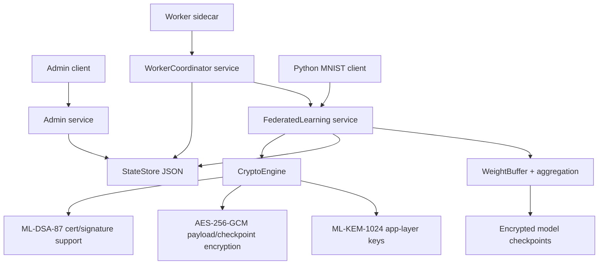

# PQ-FL

Single-node post-quantum federated learning control plane in C++/gRPC with worker orchestration, encrypted payloads, encrypted checkpoints, admin APIs, and a Python MNIST client.

## Current Status

Verified on 2026-05-24 with:

```powershell
docker build -t pqfl-server .
docker run --rm pqfl-server /app/pqfl_self_test
powershell -ExecutionPolicy Bypass -File scripts\run_smoke_verification.ps1
```

Latest smoke result:

```text
registered_clients=2
completed_rounds=2
total_submissions=4
stored_models=2
registered_workers=2
active_worker_tasks=0
Smoke verification passed.
```

The smoke produces both encrypted checkpoints:

```text
smoke-models/demo-tenant/demo-model/global_model_round_1.bin
smoke-models/demo-tenant/demo-model/global_model_round_2.bin
```

## Architecture



## Implemented

- Scheduled multi-round training jobs with worker leasing and status transitions.
- FedAvg, Krum, and trimmed-mean aggregation in `server/federated_service.cpp`.
- Round advancement after successful aggregation, so jobs progress from round 1 to round 2.
- Encrypted global model checkpoints with versioned AES-256-GCM at-rest keys.
- mTLS using OQS/OpenSSL certificates generated with `dilithium5` / ML-DSA-87.
- Explicit app-layer ML-KEM-1024 fields for payload key agreement on config, worker leases, submissions, and stream messages.
- Worker demo submits ML-KEM-protected AES-256-GCM payloads when the server advertises a KEM public key.
- Python MNIST client auto-generates protobuf stubs, auto-selects CUDA when available, uses server-assigned rounds, fetches/decrypts base models, and submits encrypted weights.
- Smoke regression script verifies two full rounds and both checkpoint files.

## Important Limitations

- The reference worker fetches round-2 base models through the live `StreamGlobalModel` RPC and no longer falls back to checkpoint-file loading.
- The async `StreamGlobalModel` path is covered by cancellation, slow-consumer backpressure, and concurrent-connection smoke tests.
- Python MNIST participation is implemented and verified separately from the Docker smoke because downloading/installing the PyTorch/MNIST stack is environment and network dependent.
- Persistence is local JSON plus local checkpoint files, not a database.
- This is single-node orchestration, not a distributed production FL cluster.

## Quick Start

Build and run the verified smoke:

```powershell
docker build -t pqfl-server .
docker run --rm pqfl-server /app/pqfl_self_test
powershell -ExecutionPolicy Bypass -File scripts\run_smoke_verification.ps1
```

Generate certificates manually:

```powershell
docker run --rm -v "${PWD}/certs-test:/app/certs" pqfl-server /app/scripts/generate_certs.sh /app/certs
```

Run the MNIST client:

```powershell
cd clients\mnist
python -m pip install -r requirements.txt
python train.py --address localhost:50051 --certs ..\..\certs-test --payload-key ..\..\smoke-data\payload.key --client-id mnist-1 --shard 0 --device auto
```

`--device auto` uses CUDA automatically when PyTorch sees your GPU.

## Repo Layout

```text
server/              C++ server, admin client, worker demo, self-test
proto/               gRPC service definitions
clients/mnist/       Python PyTorch MNIST client
scripts/             certificate generation and smoke verification
docs/                crypto architecture and threat model
proofs/              prior proof artifacts
```

## Key Files

- `server/federated_service.cpp`: FL RPCs, aggregation, async CQ handling.
- `server/state_store.cpp`: jobs, assignments, workers, persisted state.
- `server/crypto_engine.cpp`: AES-GCM, ML-KEM app-layer helpers, key derivation.
- `server/worker_service.cpp`: worker registration and task leasing.
- `server/worker_demo_client.cpp`: reference worker execution path.
- `clients/mnist/train.py`: GPU-aware MNIST training client.
- `scripts/run_smoke_verification.ps1`: current end-to-end regression.

## License

Apache License 2.0. See `LICENSE`, `NOTICE`, and `COPYRIGHT`.
