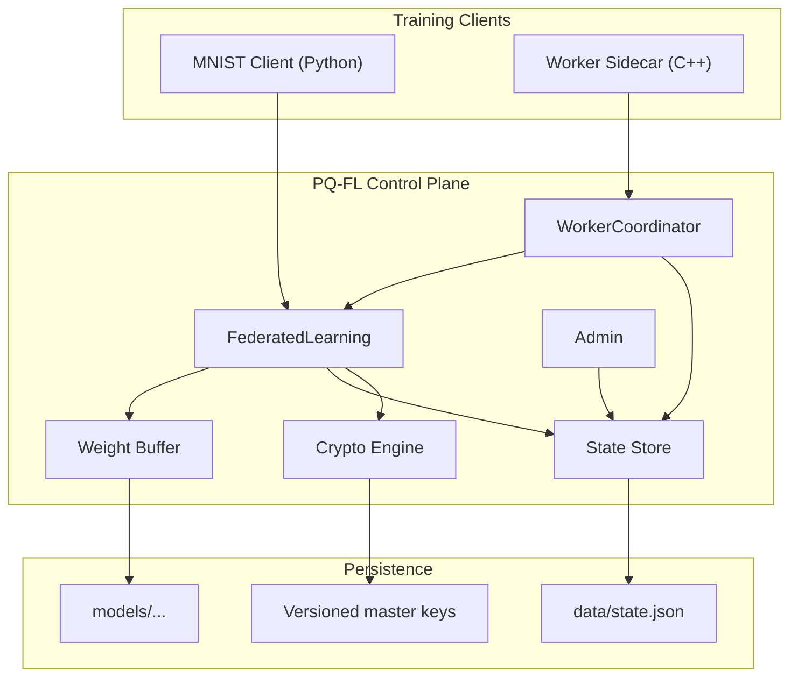

# PQ-FL

Single-node federated-learning control plane in C++/gRPC with post-quantum TLS, encrypted checkpoints, admin APIs, worker orchestration, and a Python training client.

## What it does

- Registers trainer clients scoped to tenant/model pairs
- Leases scheduled round assignments from a training job scheduler
- Accepts encrypted weight payloads over mutual TLS (ML-KEM-1024 + ML-DSA-87)
- Aggregates updates with `fedavg`, `krum`, or `trimmed_mean`
- Applies L2 gradient clipping and differential privacy noise
- Persists encrypted global-model checkpoints with versioned at-rest keys
- Exposes admin APIs for datasets, jobs, rollback, audit, workers, and key rotation
- Coordinates external worker sidecars with lease/heartbeat/status tracking

## Current scope

This is a single-node control plane with demo workers and a real MNIST training client. It is not a production FL platform — see [Known Limitations](#known-limitations).

## Architecture



## Services

### FederatedLearning

Defined in [proto/pqfl.proto](proto/pqfl.proto).

- `RegisterClient` — register an edge client
- `GetTrainingConfig` — pull hyperparameters and a training assignment
- `SubmitWeights` — submit encrypted local weight updates
- `StreamGlobalModel` — receive signed global model updates

### Admin

Defined in [proto/admin.proto](proto/admin.proto).

- `GetSystemStatus`, `ListModels`, `ListClients`
- `ListWorkers`, `ListWorkerTasks`
- `UpsertDataset`, `ListDatasets`
- `CreateTrainingJob`, `ListTrainingJobs`
- `RollbackModel`, `RotateAtRestKey`
- `ListAuditEvents`

### WorkerCoordinator

Defined in [proto/worker.proto](proto/worker.proto).

- `RegisterWorker`, `LeaseTrainingTask`
- `ReportTaskStatus`, `Heartbeat`

## Security

Transport uses mutual TLS with ML-KEM-1024 key exchange and ML-DSA-87 signatures via OQS-OpenSSL. Weight payloads are encrypted with AES-256-GCM using per-session keys derived from a shared secret and RPC context. Checkpoints are encrypted at rest with versioned master keys. Streamed model updates are signed by the server's ML-DSA-87 private key.

See [docs/crypto-architecture.md](docs/crypto-architecture.md) for the full layered design and [docs/threat-model.md](docs/threat-model.md) for threat analysis.

## Repo layout

```
server/              C++ server and demo clients
proto/               gRPC service definitions
clients/mnist/       Python MNIST training client
scripts/             cert generation and smoke tests
docs/                crypto architecture and threat model
proofs/              build and test proof artifacts
```

Key source files:

- `server/main.cpp` — server bootstrap
- `server/federated_service.cpp` — FL RPCs and aggregation (FedAvg, Krum, Trimmed Mean)
- `server/admin_service.cpp` — admin RPCs
- `server/worker_service.cpp` — worker leasing and status tracking
- `server/state_store.cpp` — persistent state, job scheduler, audit log
- `server/crypto_engine.cpp` — AES-256-GCM encryption and session key derivation
- `clients/mnist/train.py` — PyTorch MNIST client with end-to-end encryption

## Quick start

### Docker build + smoke test

```bash
make build       # build the Docker image (~20 min first time)
make test        # run offline self-test
make certs       # generate ML-DSA-87 certificates
make run         # start the server
make bootstrap   # create a demo dataset and training job
make smoke       # run two workers through a full round
make status      # inspect control-plane state
```

### MNIST training client

```bash
cd clients/mnist
pip install -r requirements.txt
python -m grpc_tools.protoc -I../../proto --python_out=gen --grpc_python_out=gen ../../proto/pqfl.proto
mkdir -p gen && touch gen/__init__.py
python train.py --client-id mnist-1 --shard 0 --round 1
```

### Admin CLI

```bash
docker run --rm --network container:pqfl-server-container \
    -v "$(pwd)/certs:/app/certs:ro" pqfl-server /app/pqfl_admin_cli status
```

## Known limitations

- Single-node only — no distributed coordination layer
- The payload encryption secret is shared, not negotiated per-session via KEM
- State persistence is a local JSON file, not a database
- The C++ worker demo uses synthetic weights; real training is in the Python client
- The build targets Docker/Linux only

## License

Apache License 2.0. See [LICENSE](LICENSE), [NOTICE](NOTICE), [COPYRIGHT](COPYRIGHT).
