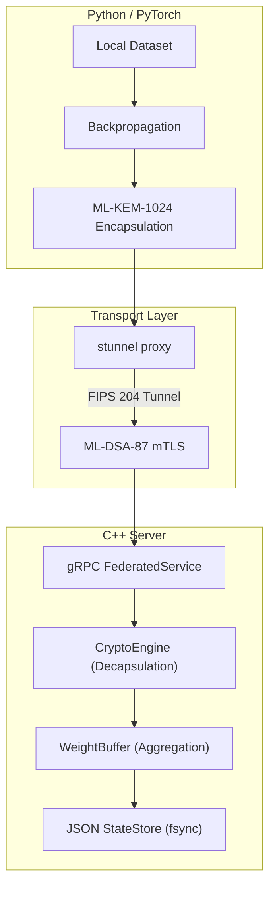

<div align="center">

# PQ-FL

### End-to-End Post-Quantum Secure Federated Learning Architecture

[](https://doi.org/10.5281/zenodo.19024628)
[](https://opensource.org/licenses/Apache-2.0)
[](https://www.researchgate.net/publication/405237327_PQ-FL_End-to-End_Post-Quantum_Secure_Federated_Learning_Architecture)

[](https://isocpp.org/)
[](https://www.python.org/)
[](https://pytorch.org/)
[](https://www.docker.com/)
[](https://www.openssl.org/)
[](https://grpc.io/)

---

*The first open federated learning control plane secured end-to-end using the finalized NIST Post-Quantum Cryptography (PQC) standards (FIPS 203 & FIPS 204), protecting distributed AI against Harvest-Now-Decrypt-Later attacks.*

[Research Paper](https://doi.org/10.5281/zenodo.19024628) · [ResearchGate](https://www.researchgate.net/publication/405237327_PQ-FL_End-to-End_Post-Quantum_Secure_Federated_Learning_Architecture)

</div>

---

## What It Does

PQ-FL is not just a theoretical framework. It is a highly optimized, deployable C++ and Python federated learning architecture that natively integrates post-quantum cryptography to secure machine learning payloads in transit and during aggregation:

1. **ML-DSA-87 (Dilithium5) mTLS Identity** — Transport-layer authentication powered by a novel `stunnel` sidecar pattern, bridging the BoringSSL PQC gap for Python edge clients.
2. **ML-KEM-1024 (Kyber1024) Key Encapsulation** — Application-layer ephemeral key agreement, wrapping symmetric AES-256-GCM session keys.
3. **Byzantine-Resilient Aggregation** — Support for standard `FedAvg`, distance-minimizing `Krum`, and robust `Trimmed-Mean` aggregations executed entirely in optimized C++.
4. **Differential Privacy (DP-SGD)** — Inherent L2 gradient clipping and Gaussian noise injection ($\sigma, \epsilon$) before centralized model accumulation.
5. **Asynchronous Streaming** — High-performance gRPC Completion Queue (CQ) threading to handle dynamic edge disconnects, backpressure, and real-time global model streaming.

## Features

| Area | What it does |
| --- | --- |
| 🛡️ Post-Quantum | ML-KEM-1024 payload confidentiality and ML-DSA-87 mTLS transport security |
| 🤖 PyTorch Native | Python clients with auto-flattening tensors and CUDA auto-detection |
| 📊 Aggregation | Server-side C++ FedAvg, Krum, and Trimmed-Mean |
| 🔒 Privacy | DP-SGD Gaussian noise and L2 norm clipping |
| 🚀 Performance | Multi-threaded C++ `FederatedService` with OpenMP SIMD optimizations |
| 📦 Deployment | Multi-stage Docker builder yielding minimal runtime footprints |

## Architecture

PQ-FL splits cryptographic responsibilities to ensure both identity verification and data confidentiality without compromising deep learning workflows.

1. **Edge Clients (Python/PyTorch)**: Compute local gradients, negotiate ML-KEM-1024 session keys, and dispatch AES-GCM encrypted payloads.
2. **Transport Proxy (stunnel)**: A localized daemon compiled against OQS-OpenSSL that handles the computationally heavy ML-DSA-87 mTLS handshake.
3. **Control Plane (C++)**: An orchestration engine managing the state machine, asynchronous gRPC streams, and thread-safe JSON atomic state stores.

### System Flow



## Security Model

- **Transport-Layer Security (FIPS 204)**: All network traffic is encapsulated in a mutually authenticated TLS 1.3 tunnel using ML-DSA-87 certificates.
- **Application-Layer Key Agreement (FIPS 203)**: Raw model payloads are encrypted end-to-end utilizing ML-KEM-1024 ciphertexts and AES-256-GCM.
- **Harvest-Now-Decrypt-Later (HNDL)**: Resistance against quantum eavesdroppers capable of recording current traffic for future cryptanalysis.
- **Atomic State Transitions**: JSON state storage using POSIX `rename()` guarantees data integrity during concurrent aggregation events.

## Stack

| Layer | Technology |
| --- | --- |
| Client | Python, PyTorch, gRPC (grpcio-tools) |
| Backend | C++17, gRPC, Protobuf |
| Aggregation | OpenMP SIMD, `<algorithm>` (`std::nth_element`) |
| Crypto | OpenSSL 1.1.1u, liboqs (0.12.0), stunnel v5.78 |
| Runtime | Docker Multi-stage Builds |

## Research & Publications

This architecture builds upon earlier Quantum-Safe Backend foundational research, applying those paradigms directly to distributed artificial intelligence.

| Paper | Title |
| --- | --- |
| **PQ-FL** | *PQ-FL: End-to-End Post-Quantum Secure Federated Learning Architecture* |
| **QSB (Part I)** | *Quantum Safe Backend: Design and Implementation of a Post-Quantum Cryptographic Secure Storage and Communication Platform* |

#### Mirrors & Archives

| Platform | Link |
| --- | --- |
| 📄 ResearchGate | [PQ-FL on ResearchGate](https://www.researchgate.net/publication/405237327_PQ-FL_End-to-End_Post-Quantum_Secure_Federated_Learning_Architecture) |
| 🗄️ Zenodo (DOI) | [](https://doi.org/10.5281/zenodo.19024628) |

#### Citation

```bibtex
@inproceedings{sujith2026pqfl,
  title     = {PQ-FL: End-to-End Post-Quantum Secure Federated Learning Architecture},
  author    = {B. Sujith},
  year      = {2026},
  publisher = {Independent Researcher}
}
```

## Quick Start

### Building the Infrastructure

The entire orchestration server, OQS-OpenSSL dependencies, and gRPC stubs can be built using the provided multi-stage Dockerfile.

```bash
# Build the C++ Server Image
docker build -t pq-fl-server -f Dockerfile .

# Build the Python Client & stunnel sidecar Image
docker build -t pq-fl-client -f Dockerfile.python-client .
```

### Running the E2E Test

To validate the integration of ML-KEM-1024, ML-DSA-87, and PyTorch aggregation locally:

```bash
bash scripts/run_e2e_integration_test.sh
```

## License

This project is licensed under the Apache License 2.0. See [LICENSE](./LICENSE) for details.

---

<div align="center">

**[PQ-FL GitHub Repository](https://github.com/Sujithb128989/PQ-FL)**

[](https://doi.org/10.5281/zenodo.19024628)

</div>
